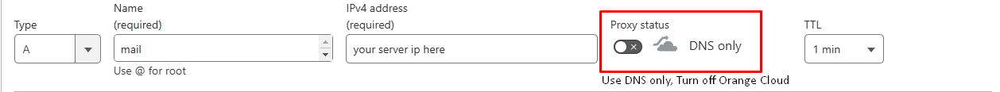
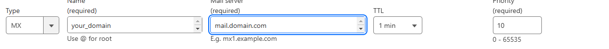
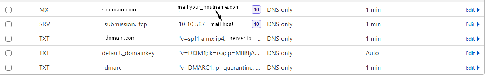
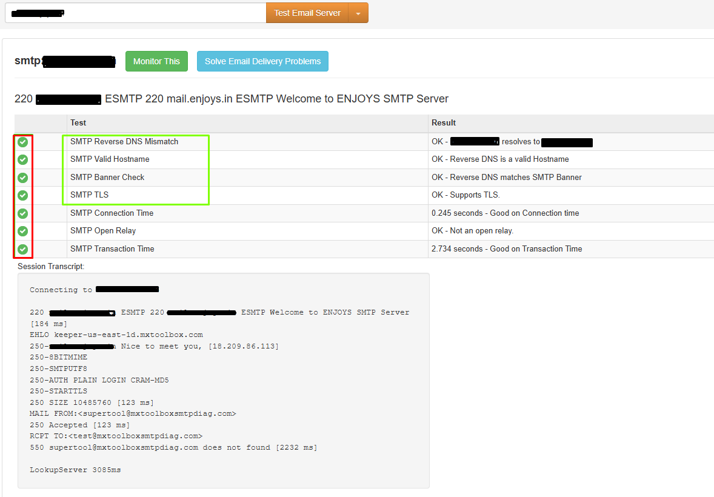

# This Project is Under Develepment

[Setup Video](https://media.cm/u/H5U7)

This project started as a fun experiment but has grown into something more. Right now, it's a simple mail server for sending and receiving emails. Future updates will add:

-   **Mail Exchanger (IMAP)** – Use Gmail, Outlook, Yahoo, or Hotmail to send and receive emails.
-   **Extra Features** – SMTP relay, IP/domain whitelisting & blacklisting.
-   **AI Email Optimization** – Smart suggestions to improve email performance.
-   **Security & Anti-Spam** – AI-driven spam filtering and fraud detection.
-   **User Controls** – Rate limits, storage alerts, email forwarding, and aliases.
-   **Calendar Integration** – Works with Google Meet, Teams, and Cal.com.
-   **Developer API** – Easy-to-use API for automating emails in your apps.
# SMTP Server Setup Guide

### Prerequisites

- A registered domain name

- A server with a static IP address

- SSL/TLS certificate for secure email transmission

### Basic Server Setup

- Configure your server with a static IP address

- Ensure your firewall allows SMTP traffic (ports 25, 465, and 587)

- Set up reverse DNS (PTR record) for your mail server IP (- Most Important)

#### Clone the Repository

Use Any Package Manager, I'm just using bun, to install check out `bun.sh`

1.  Install Dependencies First (Recommended) `bun install`

2.  Build the Applications `bun run build`, dont use `bun build`

3.  Start with command `bun run dev` (Development) and `bun run
start` with root permissions (Incase not able to start then use
    `sudo node ./build/main.js`)

## NOTE

You will find two server file config (Incoming and Outgoing) and 2 server listening at 25 and 587.
We can do it one, but we have to manage incoming and outgoing in same file, which is a mess, complicates the code. Moreover you have full controll to run multiple diffrente mail server like `mx.domain.com`, `mx2.domain.com` etc and for sending `{smtp,mail}.domain.com` (which ever is suitable).

# DNS Records Configuration
 Please Setup PTR(Reverse Lookup) and `MAIL_HOST`, `MAIL_SERVER_IP` first
### How to genrate DNS Records
1.
- ```bash chmod +x run.sh```
- ```bash ./run.sh```
2 .
- Go to src -> start.ts

- Open and replace `your_domain` with your domain name

```ts
const records = new DNSRecordGenerator("cirrusmail.cloud").generateAllRecords();
```

and Run this File, Records will create in `records.json` File in root directory.

### Essential DNS Records



1. A Record

- Create mail.yourdomain.com pointing to your server IP
- Ensure the hostname matches SSL certificate

2 .PTR Record

- Contact your hosting provider to set up reverse DNS
- Should match your mail server's hostname

Share your Mailserver hostname, who ever wants to use your server and tell them to create MX Record pointing your server.

- Point to your mail server hostname
- Set priority (e.g., 10 mail.yourdomain.com)
  

# Anti-Spam DNS Records



1. SPF Record (TXT)

- Add record: v=spf1 ip4:YOUR_IP mx -all
- Prevents email spoofing
- Specifies authorized IPs/servers


2. DKIM Record

- Generate DKIM keys
- Add public key to DNS as TXT record
- Format: default._domainkey.yourdomain.com


3. DMARC Record

- Add TXT record: _dmarc.yourdomain.com
- Define policy for failed authentications
- Set up reporting (optional)


### Note: Required Ports => 25, 587

#### Port 25 is used for receiving mails and outbound traffice to send mail from your server to another mail server

#### Port 587 is used for to connection to your mail server and create transport which send mail and process the mail , how it is going to deliver via Direct or Relay

### Generate SSL Ceritificate for using STARTTLS to prevent spam. Dont use Self Signed Certificate

Mail Server SSL Certificate Setup

Simple guide to secure your mail server with Let's Encrypt/ZeroSSL certificates using Certbot. This setup enables encrypted SMTP connections and works with any transport method (relay or direct delivery).

### Prerequisites

Linux server with root access

Domain with DNS A record pointing to your server

Port 80 temporarily available for verification

### Installation Steps

Install Certbot:

```bash

sudo  apt  update

sudo  apt  install  certbot

```

Generate certificate:

```bash

sudo  certbot  certonly  --standalone  --preferred-challenges  http  -d  mail.domain.com

```

Certificate locations:

Certificate: /etc/letsencrypt/live/mail.domain.com/fullchain.pem

Private key: /etc/letsencrypt/live/mail.domain.com/privkey.pem

Update Your .env

```

MAIL_HOST="mail.domain.com"

MAIL_SERVER_IP="127.0.0.1"

MAX_EMAILS_PER_MINUTE=5

TLS_PRIVATE_KEY_PATH="/etc/letsencrypt/live/mail.domain.com/privkey.pem"

TLS_CERTFICATE_PATH="/etc/letsencrypt/live/mail.domain.com/fullchain.pem"

```
### Testing

- Run mail server tests:
- Verify all DNS records
- Test SMTP authentication
- Check TLS encryption
- Verify reverse DNS
- Test sending/receiving
### Use external tools:
Go and Test Your Mail Server  here , it should be like in given Image https://mxtoolbox.com/diagnostic.aspx


 
# iCalendar event for Nodemailer - Resources
### Step 1: Enable Google Calendar API
 - Go to the Google Cloud Console.
 - Create a new project or select an existing one.
 - Enable the Google Calendar API for the project.
 - Create OAuth 2.0 credentials or a service account for authentication.
 - Download the credentials JSON file.

```bash
npm install googleapis nodemailer ics
```
## Integration
- [x]  Google Meet/Calender
- [ ]  Cal.com
- [ ]  Zoho Calender
- [ ]  Zoom Meetings


### Calender UI
- https://shadcn-cal-com.vercel.app/?date=2025-03-02
- https://github.com/Mina-Massoud/next-ui-full-calendar
- https://github.com/schedule-x/schedule-x
- https://synergy-platform.vercel.app/calendar
- https://github.com/charlietlamb/calendar
- https://github.com/list-jonas/shadcn-ui-big-calendar

