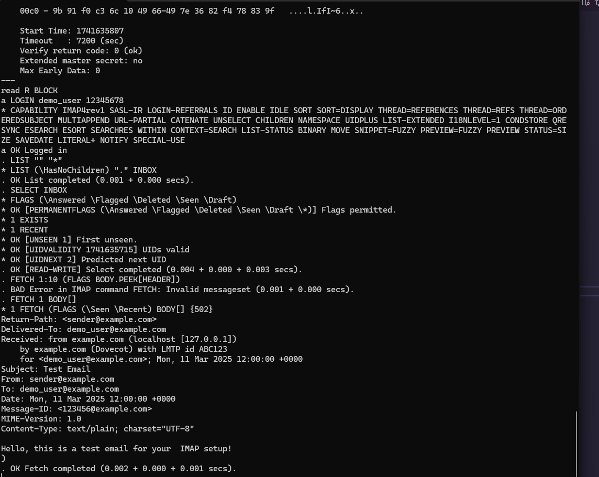

# IMAP SERVER GUIDE

`maildir` is a standard format for storing emails in a filesystem. It organizes emails in a directory structure and ensures safe message delivery by avoiding file locking issues. Here’s how you can use `maildir` to store emails:

## 1. Maildir Directory Structure

```bash
/var/mail/demo_user/
 ├── cur/   # Processed emails (read)   After being read, emails are moved here.
 ├── new/   # New emails (unread) When a new email arrives, it is placed here.
 ├── tmp/   # Temporary storage for emails during delivery Emails are written here first before being moved to new/ to prevent corruption.
```

`demo_user` This is a test user for testing Imap server it can be dynamic for that you can check DoveCot Config `/etc/dovecot/conf.d/10-mail.conf`

```bash
#   %u - username
#   %n - user part in user@domain, same as %u if there's no domain
#   %d - domain part in user@domain, empty if there's no domain
#   %h - home directory
```


## 2. Accessing Mail via IMAP, Install Dovecot

#### You can also install DB recommended are PGSQL/MYSQL for user auth and storing emails

```bash
sudo apt install dovecot-imapd
sudo systemctl status dovecot #Ensure Dovecot is Installed & Running
sudo systemctl enable dovecot
```

## 3. Creating a Maildir or use default `/var/mail

```bash
sudo mkdir -p /var/mail/demo_user/{cur,new,tmp}
sudo chown -R 5000:5000 /var/mail/demo_user
sudo chown demo_user:mail /var/mail/demo_user
sudo chmod -R 700 /var/mail/demo_user

```

# 4. Enable STARTTLS in Dovecot

```bash
sudo nano /etc/dovecot/conf.d/10-ssl.conf
# Find this line ssl = no Change it to: ssl = yes
ssl = yes
```

# 5. Set Up SSL Certificates

Use Certbot or use your SMTP Server key files/ Self Signed Certificate are not recommended

```bash
ssl_cert = </etc/letsencrypt/live/mail.example.com/fullchain.pem
ssl_key = </etc/letsencrypt/live/mail.example.com/privkey.pem
```

# 6. Enable IMAP/POP3 with STARTTLS

```bash
sudo nano /etc/dovecot/conf.d/10-master.conf
```

```bash
 service imap-login {
  inet_listener imap {
    port = 143
  }
  inet_listener imaps {
    port = 993
    ssl = yes
  }
}
```

# 7. Enforce STARTTLS in Authentication

```bash
sudo nano /etc/dovecot/conf.d/10-auth.conf
# Find:  disable_plaintext_auth = yes change it to
disable_plaintext_auth = no
```

# 8. Generate a SHA256-CRYPT Password for Dovecot

Using `doveadm pw -s SHA256-CRYPT`

# Add the User to Dovecot's Passwd File

```bash
demo_user:{SHA256-CRYPT}$5$jQTohcyIhS5AHZlb$iIw20/JKVNluAK5H23BaReJfToTWpM5GZI9sU6bVsg1::::::
```

`::::::` dont touch those fields should be specified in next step ,will automatically assign the correct UID, GID, home directory, and mail storage.

- Replace the hashed password with the one you generated.
- 1000:1000 represents UID:GID (use your system’s values).
- /home/demo_user is the home directory.

# 9. Ensure mail_uid and mail_gid are Set

Find an unused UID (e.g., 5000):

```bash
getent passwd 5000
# If it returns nothing, 5000 is free to use.
```

```bash
sudo nano /etc/dovecot/conf.d/10-mail.conf
```

```bash
mail_uid = 5000
mail_gid = 5000
```

`/etc/dovecot/conf.d/auth-passwdfile.conf.ext`:

```bash
passdb {
  driver = passwd-file
  args = scheme=SHA256-CRYPT /etc/dovecot/users.passwd
}

userdb {
  driver = static
  args = uid=5000 gid=5000 home=/var/mail/%u mail=maildir:/var/mail/%u
}

```

## 10. Testing IMAP Login

- Using Telnet

```bash
telnet localhost 143
```

```bash
a1 LOGIN user@example.com password
```

```bash
a1 OK Logged in # If successful, you'll get:
. LIST "" "*" #   Check Available Mailboxes

. SELECT INBOX # Select a Mailbox

. FETCH 1 BODY[] #  fetch the full email content:

. LOGOUT # When done, close the session with:

```

### The Output be Like this 

- Alternatively, you can use Thunderbird, Roundcube, or another email client to connect via IMAP.

## Expected Error
If you face this error then try:
```bash
Error: stat(/var/mail/demo_user/tmp) failed: Permission denied (euid=5000(<unknown>) egid=5000(<unknown>) missing +x perm: /var/mail/demo_user, dir owner missing perms)```
If the issue persists, check logs again:
```bash
sudo mkdir -p /var/mail/demo_user/{new,cur,tmp}  
sudo chmod -R 700 /var/mail/demo_user
sudo chmod 755 /var/mail
# and still facing error then use /*   udo chmod -R 700 /var/mail/demo_user/*
sudo journalctl -u dovecot --no-pager | tail -n 50
```